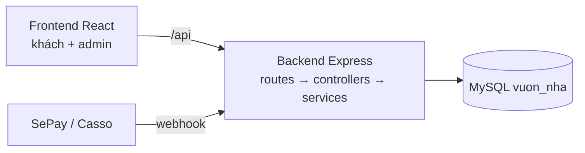
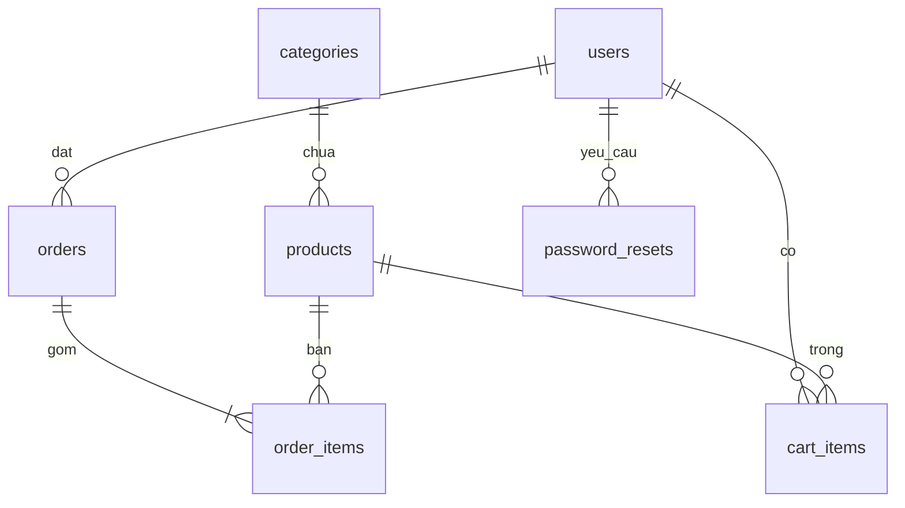

# Sơ đồ (Mermaid – xem trên GitHub/VS Code có extension Mermaid)

## Kiến trúc

```mermaid
flowchart LR
  FE[Frontend React<br/>khách + admin] -->|/api| BE[Backend Express<br/>routes → controllers → services]
  BE --> DB[(MySQL vuon_nha)]
  Bank[SePay / Casso] -->|webhook| BE
```

## ERD

```mermaid
erDiagram
  users ||--o{ orders : dat
  users ||--o{ cart_items : co
  categories ||--o{ products : chua
  products ||--o{ cart_items : trong
  orders ||--|{ order_items : gom
  products ||--o{ order_items : ban
  users ||--o{ password_resets : yeu_cau
```
